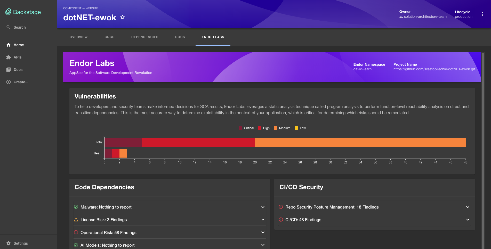

# Endor Labs Backstage Plugins

## Overview

This README documentation is intended for the Endor Labs backend and frontend plugins for Backstage, which integrates vulnerability data from Endor Labs into the Backstage ecosystem. These plugins help development teams understand the high-level supply chain risks associated with their software components without having to leave the Backstage portal. The plugins make use of the Endor Labs APIs and so can be customised to meet your specific requirements.

## Features



- **Project Summary Integration**: Fetch and display a summary of vulnerability findings related to your project from Endor Labs.
- **Interactive Charts**: View vulnerability levels (Critical, High, Medium, Low) and interact with them to see detailed filtered results.
- **Status Accordions**: Detailed panels for various categories like CI/CD, Malware, License Risk, Operational Risk, Secrets, and SCPM (Secure Code Posture Management). The plugin summarises findings in term of categories but it's useful to know that a finding can be in multiple categories.
- **Dynamic Link Generation**: Generate URLs dynamically to access detailed vulnerability reports based on the filters applied.

## Limitations

* The plugins are designed for use with the new (Backstage System Architecture)[https://backstage.io/docs/backend-system/architecture/index]
* The plugins assume a 1:1 mapping between Backstage components and Endor Labs Projects (code respositories) and therefore may not be suitable for monorepos
* The plugins do not display findings associated with packages
* The backend plugin only supports authentication via API keys (and therefore do not use the Backstage user's identity for authentication or authorization)

## Prerequisites

Before installing the plugin, ensure that you have:

- A running instance of Backstage using the [new backend system](https://backstage.io/docs/backend-system/building-backends/migrating). You can set up a new instance by following this [guide](https://backstage.io/docs/getting-started/).
- Access to the Endor Labs platform to create an API Key/Secret.

## Installation

1. Run this from the root of your Backstage installation:
    ```bash {"id":"01HXS2CKPR1PB9WEYSAD8XBMTJ"}
      # Download the ZIP file
      curl -L https://github.com/endorlabs/backstage-plugin/archive/refs/heads/main.zip -o endor.zip

      # Extract the plugins from the ZIP archive to the backstage plugins folder
      unzip endor.zip "backstage-plugin-main/endor-backend/*" "backstage-plugin-main/endor-frontend/*" -d plugins && \
      mkdir plugins/endor-backend && \
      mkdir plugins/endor-frontend && \
      mv plugins/backstage-plugin-main/endor-backend/* plugins/endor-backend/ && \
      mv plugins/backstage-plugin-main/endor-frontend/* plugins/endor-frontend/ && \
      rm -rf plugins/backstage-plugin-main && \
      rm -rf endor.zip
      
    ```

1. Install the necessary dependencies. You may be prompted to choose a version for some dependencies, select the latest:
    ```bash {"id":"01HXS2CKPR1PB9WEYSAE8WP06H"}
    yarn install
    ```

### Backend Plugin

1. Add the plugin to the `packages/backend/src/index.ts` file like so:
    ```typescript {"id":"01HXS36AQM476VJ90SRMVE212A"}
      import endorBackendPlugin from '@endorlabs/backend-plugin';

      const backend = createBackend();

      ...

      backend.add(endorBackendPlugin);
    ```
1. Create a set of API keys with the read-only permission within the Endor Labs platform (docs)[https://docs.endorlabs.com/administration/api-keys/]
1. Add the following to your relevant installation file (e.g. app-config.local.yaml):
    ```yaml {"id":"01HXS36AQM476VJ90SRPB64A7D"}
      endor:
        apiKey: <Your Endor Labs API Key>
        apiSecret: <Your Endor Labs API Secret>
        apiUrl: <Your Endor Labs API Url, e.g. https://api.endorlabs.com>
        appUrl: <Your Endor Labs Web Url; e.g. https://app.endorlabs.com> #Optional, defaults to https://app.endorlabs.com
    ```
1. Run `yarn dev` from the root folder to start Backstage.
1. Navigate to [/endor-backend/health](http://localhost:7007/api/endor-backend/health) to verify you receive a HTTP 200/OK response.
1. Optional: navigate to [/endor-backend/namespaces/:namespace/summary/:projectUUID](http://localhost:7007/api/endor-backend/namespaces/:namespace/summary/:projectUUID) (replace the substitute  path parameters a valid namespace/projectUUID) to verify you can access data.

### Frontend Plugin

1. Add the EndorFrontendPage to your `/packages/app/src/App.tsx` file:
    ```typescript {"id":"01HXS2CKPR1PB9WEYSAGDC5SKY"}
    import { EndorFrontendPage } from '@endorlabs/frontend-plugin';
    const routes = (
    <FlatRoutes>
      ...
      <Route path="/endor" element={<EndorFrontendPage />} />
    </FlatRoutes>
    );
    ```

1. Add the EndorFrontendPage to your `/packages/app/src/components/catalog/EntityPage.tsx` file (or another component if preferred):
    ```typescript {"id":"01HXS2CKPR1PB9WEYSAKMNPTN9"}
    import { EndorFrontendPage } from '@endorlabs/frontend-plugin';
    const websiteEntityPage = (
      <EntityLayout>
        ...
        <EntityLayout.Route path="/endor" title="Endor Labs">
          <EndorFrontendPage/>
        </EntityLayout.Route>
      </EntityLayout>
    );
    ```

## Configuration

Ensure your Backstage catalog includes the Endor Labs annotations for each component:

    ```yaml {"id":"01HXS2CKPR1PB9WEYSAPCDTNNA"}
    metadata:
      annotations:
        endorlabs.com/namespace: <your namespace>
        endorlabs.com/project-uuid: <your project uuid>
    ```

## Usage

Once you have added the Endor annotations, navigate to the component page and select the Tab called "Endor Labs". You will see various information cards and charts that provide a comprehensive view of the vulnerabilities associated with your project. Interact with the charts and accordions to explore different findings and click-through to Endor Labs for detailed finding reports.

## Future Enhancements

* Pull in the recommendations from the Endor Labs platform to help prioritise remediation efforts
* Extend to provide support for a package annotation (to support monorepo configurations)
* Publish the plugins to NPM
* List plugin within the Backstage [plugin directory](https://backstage.io/docs/plugins/add-to-directory)