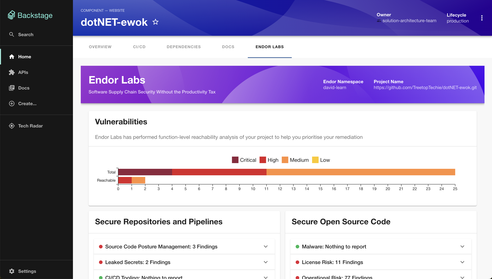

# Endor Labs Frontend Plugin for Backstage

## Overview

This README documentation is intended for the Endor Labs Frontend Plugin for Backstage, which integrates vulnerability data from Endor Labs into the Backstage ecosystem. This plugin provides a frontend to visualize and manage the security posture of your software projects by displaying vulnerability metrics and links to detailed findings.

## Features



- **Project Summary Integration**: Fetch and display a summary of vulnerability findings related to your project from Endor Labs.
- **Interactive Charts**: View vulnerability levels (Critical, High, Medium, Low) and interact with them to see detailed filtered results.
- **Status Accordions**: Detailed panels for various categories like CI/CD, Malware, License Risk, Operational Risk, Secrets, and SCPM (Secure Code Posture Management). The plugin summarises findings in term of categories but it's useful to know that a finding can be in multiple categories.
- **Dynamic Link Generation**: Generate URLs dynamically to access detailed vulnerability reports based on the filters applied.

## Limitations

* The plugin currently displays information from a Endor Labs project, this assumes a 1:1 mapping between services and code respositories (and is therefore not suitable for a monorepo)
* It does not display findings associated with packages
* It does not use the user's own identity to control authorised access to data

## Prerequisites

Before installing the plugin, ensure that you have:

- A running instance of Backstage using the [new backend system](https://backstage.io/docs/backend-system/building-backends/migrating). You can set up a new instance by following this [guide](https://backstage.io/docs/getting-started/).
- Installed, configured and tested the Endor Labs Backend Plugin (from this repository).

## Installation

1. Clone the plugin repository into your Backstage plugins directory:

```bash {"id":"01HXS2CKPR1PB9WEYSAD8XBMTJ"}
cd plugins && git clone https://github.com/endorlabs/backstage-plugin
```

2. Install the necessary dependencies:

```bash {"id":"01HXS2CKPR1PB9WEYSAE8WP06H"}
cd endor && yarn install
```

3. Add the EndorFrontendPage to your [App.tsx](packages/app/src/App.tsx) file:

```typescript {"id":"01HXS2CKPR1PB9WEYSAGDC5SKY"}
import { EndorFrontendPage } from '@internal/backstage-plugin-endor';
const routes = (
<FlatRoutes>
  ...
  <Route path="/endor" element={<EndorFrontendPage />} />
</FlatRoutes>
);
```

4. Add the EndorFrontendPage to your [EntityPage.tsx](packages/app/src/components/catalog/EntityPage.tsx) file:

```typescript {"id":"01HXS2CKPR1PB9WEYSAKMNPTN9"}
import { EndorFrontendPage } from '@internal/backstage-plugin-endor';
const websiteEntityPage = (
  <EntityLayout>
    ...
    <EntityLayout.Route path="/endor" title="Endor Labs">
      <EndorFrontendPage/>
    </EntityLayout.Route>
  </EntityLayout>
);
```

## Configuration

Ensure your Backstage catalog includes the Endor Labs annotations for each entity:

```yaml {"id":"01HXS2CKPR1PB9WEYSAPCDTNNA"}
metadata:
  annotations:
    endorlabs.com/namespace: <your namespace>
    endorlabs.com/project-uuid: <your project uuid>
```

## Usage

Once you have added the Endor annotations, navigate to the component page and select the Tab called "Endor Labs". You will see various information cards and charts that provide a comprehensive view of the vulnerabilities associated with your project. Interact with the charts and accordions to explore different findings and access detailed vulnerability reports.

## Future Enhancements

* Pull in the recommendations from the Endor Labs platform to help prioritise remediation efforts
* Extend to provide support for a package annotation which would help with monorepo configurations